.. deployment .

.. contents:: 本章目录
  :depth: 2

-----------
系统部署
-----------

Nano平台提供了Installer安装程序用于自动化部署，最新版本Installer可以通过 `官网下载 <https://nanos.cloud/zh-cn/download.html>`_ 或者 `Github发布页面 <https://github.com/project-nano/releases/releases>`_ 获取。

Installer会自行选择最合适的配置进行建议， **对于初次安装Nano的新用户，安装过程中尽量不要调整任何参数** ，如需调整参数、修改配置或者直接升级二进制文件，请在熟悉产品后进行操作。

服务器要求：

- 支持虚拟化的X86服务器或者打开嵌套虚拟化（Intel VT-x/AMD-v）的虚拟机
- 2核4G内存50GB磁盘和一个网络设备
- CentOS 7.6(1810) Minimal
- 操作系统安装完成并且网络就绪
- 如有raid/lvm请先完成配置，再进行Nano安装

建议使用刚装完CentOS7.6的纯净系统开始安装，避免残留设置或者依赖版本有问题影响顺利部署。

模块安装
============

安装Nano平台，只需要解压并执行Installer即可。只需要选择需要在当前服务器部署的模块，Installer会自动完成参数配置、依赖安装和模块部署。

以1.0.0为例，在shell执行以下指令：

::

  $wget https://nanos.cloud/media/nano_installer_1.0.0.tar.gz
  $tar zxfv nano_installer_1.0.0.tar.gz
  $cd nano_installer
  $./installer

Installer启动后首先要求输入要安装的模块，比如输入"2"+回车只安装Cell，或者可以输入"3"+回车，在一个服务器安装所有模块。

Installer默认把模块安装在/opt/nano目录下，默认的通讯域标识为<"nano":224.0.0.226:5599>，对于初次安装或者网络内仅有一套Nano平台的用户，不建议调整参数，以免错误参数影响平台工作。

如果选择安装Cell模块，Installer会要求用户输入"yes"确认构建默认的桥接网络br0； **如果已经有其他程序设置的br0，建议先手工删除，再安装Cell，否则可能会导致云主机网络连接不正常** 。如果是以往Nano安装生成的br0则无影响，可以跳过。

 *已知部分服务器在进行桥接时，会因为网卡驱动原因导致SSH连接中断从而造成安装失败，请使用IPMI或者iDRAC类似远程服务接口执行installer*

Installer在安装过程中，会选择模块启动监听服务的网卡和地址，如果仅有一张网卡，Installer会自动选择并进行配置；如果存在多个网卡，Installer会列出设备清单要求用户选择Nano集群需要工作的网段。

假如服务器有两个网卡，eth0地址为192.168.1.56/24，eth1地址为172.16.8.55/24，如果希望Nano集群工作在172.16.8.0/24网段，则选择eth1即可。

 *请注意：Installer会首先使用自带RPM包安装依赖库，如果出现版本冲突，则尝试使用yum从网络获取更新版本；如果系统已经预装了会导致冲突的版本，请确保网络可用，以便顺利安装。*

模块启动
============

所有Nano平台模块都使用命令行控制，调用方式："<模块名称> [start\|stop\|status\|halt]"，支持的指令含义如下：

- start: 启动模块，故障打印错误信息，成功则输出版本及必要信息
- stop: 优雅停止模块，自动释放相关资源并通知相关模块
- status: 检查模块是否在运行中
- halt: 强制终止模块运行

模块安装完成后，需要启动模块以提供服务，模块默认安装在/opt/nano目录下。使用命令手动启动所有模块（假定所有模块安装在同一台服务器）， **请注意，必须首先启动Core模块** 。

::

  $cd /opt/nano/core
  $./core start
  $cd ../cell
  $./cell start
  $ cd ../frontend
  $./frontend start

FrontEnd模块成功启动后，Console会输出一个形如"192.168.6.3:5870"的监听地址，使用Chrome或者Firefox访问这个地址就可以开始通过Web门户管理Nano平台了。

初始化系统
=============

初次打开Nano管理页面，会提示输入账号密码，创建初始管理员，密码要求长度不小于8位，必须包含数字、小写字母和大写字母各一个。

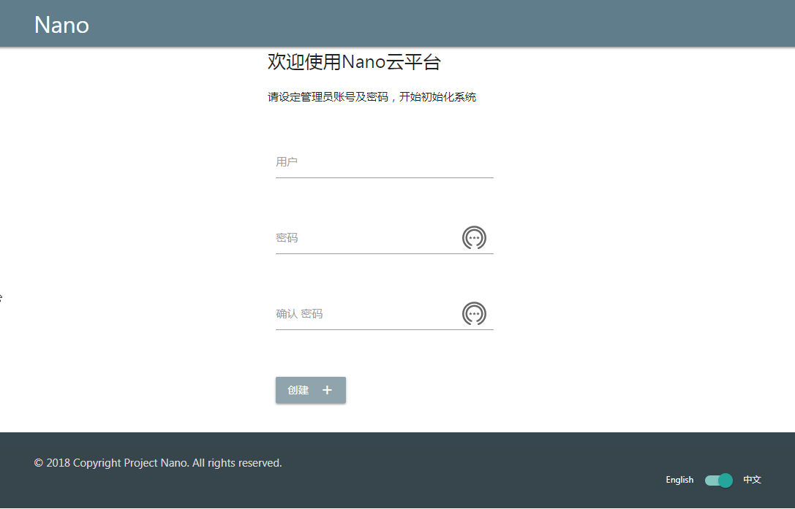

创建成功后进入登录界面，登录成功后可以开始管理Nano平台或者为你的团队创建更多用户账号。

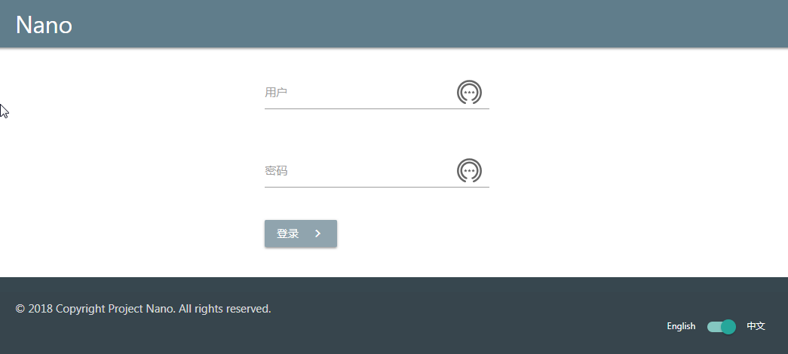

界面底部会显示已登录用户，点击按钮注销。

设置共享存储(可选)
======================

默认情况下，Nano中云主机实例的磁盘数据存储在承载Cell节点的本地存储系统中，无需额外配置，性价比也最高。不过管理员也可以指定将数据存储在独立的NFS文件服务器上，防止Cell节点故障影响云主机服务，也可以更方便地在节点之间迁移实例，重新均衡负载，以提升集群整体性能和使用寿命。

使用共享存储，只需要创建一个存储资源池，然后与计算资源池关联。关联之后，所有添加到该资源池的资源节点，都会由Nano自动配置为使用共享存储，无需用户干预和设置。

一个存储池对应一个共享存储路径，一个存储池可以同时为多个计算池提供后端存储，但是每个计算资源池只能绑定一个存储池。

配置NFS服务器
................

要让Nano正常使用NFS存储后端，首先需要正确配置好NFS服务器。

假定NFS Server地址为192.168.3.138，共享路径为/var/nfs/nano，Nano集群网段为192.168.3.0/24。

以CentOS 7.6为例，在NFS Server端执行以下指令：

::

    开启防火墙端口
    $firewall-cmd --zone=public --add-service=nfs --permanent
    $firewall-cmd --reload

    安装NFS服务并设置为开机启动
    $yum install nfs-utils
    $systemctl start nfs
    $systemctl enable nfs

    创建路径
    $mkdir -p /var/nfs/nano

由于NFS是将客户端用户直接映射到服务端用户进行权限判断，当管理员使用不同的用户运行Nano模块和KVM服务时，需要设置不同的访问规则。

使用root用户运行Nano和KVM/QEMU服务
,,,,,,,,,,,,,,,,,,,,,,,,,,,,,,,,,,,,

NFS默认禁止将客户端root映射为服务端root用户，所以配置路径时需要使用no_root_squash选项。

在NFS Server执行

::

  创建规则文件
  $vi /etc/exports

  将以下规则写入文件
  /var/nfs/nano 192.168.3.0/24(rw,sync,no_subtree_check,no_root_squash)

  映射共享路径
  $exportfs -a

使用普通用户运行Nano和KVM/QEMU服务
,,,,,,,,,,,,,,,,,,,,,,,,,,,,,,,,,,,,

对于普通用户，NFS是根据客户端用户的uid/gid映射到本地相同id用户和组进行权限校验。

假定Cell节点运行Nano和KVM/QEMU的是用户及用户组为nano/nano，对应的uid/gid为108，则需要在NFS Server创建相同ID的用户，并将其设置为共享路径的owner。

在NFS Server执行以下指令：

::

  $groupadd nano -g 108
  $useradd nano -u 108 -g nano -Z system_u
  $chown nano:nano /var/nfs/nano
  $chmod 755 /var/nfs/nano

创建映射规则并共享

::

  创建规则文件
  #vi /etc/exports

  写入以下内容并保存
  /var/nfs/nano 192.168.3.0/24(rw,sync,no_subtree_check)

  映射共享路径
  #exportfs -a

----

当NFS Server配置完成后，请先使用一个客户端服务器手工mount验证设置是否正确，以减少后续Nano自动配置的故障可能。

创建存储池
.............

NFS Server配置完成后，在Web门户上选择"Storage"=>"Create"创建新的共享存储池

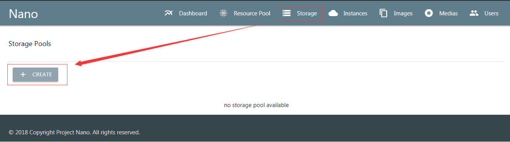

为存储池设定名称nfs-pool1，输入服务器192.168.3.138和共享路径/var/nfs/nano，点击创建

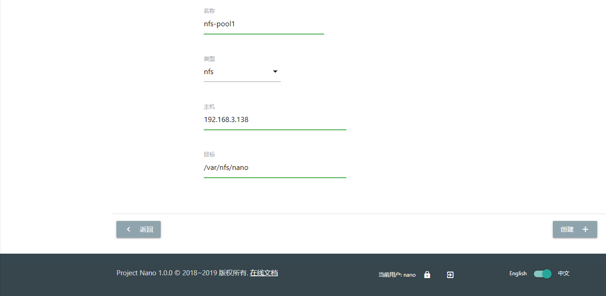

创建成功后返回存储清单，能够看到新建的存储池

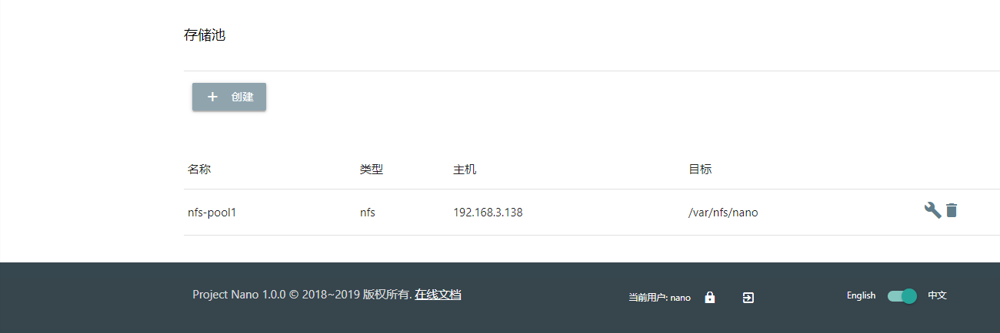

修改存储设置
...............

共享存储创建完成后，可以修改已有计算池的关联存储或者新建一个新的计算池，当新的Cell节点加入资源池后，Nano会自动同步并设置存储配置，无需用户干预。

以修改默认计算池default为例，在"Resource Pool"的资源池清单中，点击default资源池的"modify"图标，在编辑界面下拉菜单中选择新建的nfs-pool1。

建议需要保证云主机实例高可用的用户打开"Failover/故障迁移"开关，当故障迁移生效时，如果Nano检测到某一Cell节点失联，会将该节点承载的云主机实例自动迁移到集群内其他节点恢复服务，详见“平台管理-故障迁移”章节。

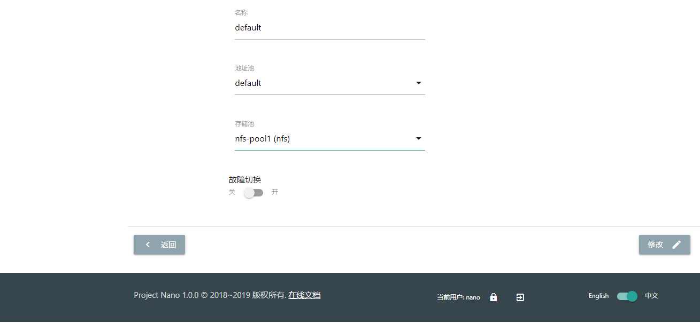

修改后检查清单中相应属性和图标是否生效

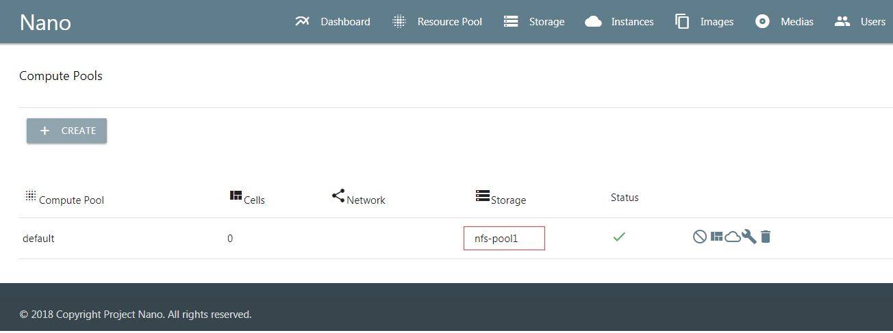

设置完成后，就可以开始往资源池中添加资源节点了，使用了共享存储的Cell节点创建实例、快照时，都会自动保存到NFS Server的共享路径上。

添加地址池（可选）
=====================

默认情况下，Nano分配的云主机实例通过桥接网络从现有物理网络设备中获取地址，但是对于希望能够精确控制实例IP的用户，可以使用地址池对网络资源进行更有效地管理。

地址池允许添加多个可用地址段，当计算资源池创建实例时，自动从指定的地址范围内分配新IP，并且通过云主机所在Cell节点的DHCP服务绑定到实例。当实例删除时，分配IP释放回地址池，可以重新由其他实例申请。

首先在地址池列表中，点击"创建"按钮新建地址池

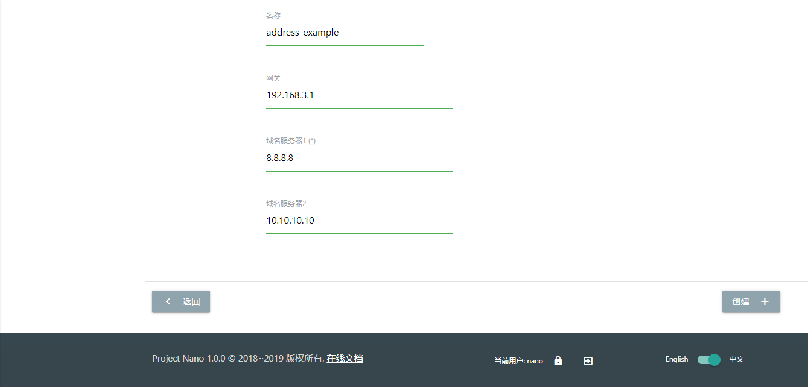

地址池名称使用字母、数字和'-'，网关和DNS是IPv4格式，当云主机实例启动时，会通过DHCP client获得这里设定的参数并建立内部网络配置。创建成功后，返回地址池列表，点击“详情”添加可用地址段。

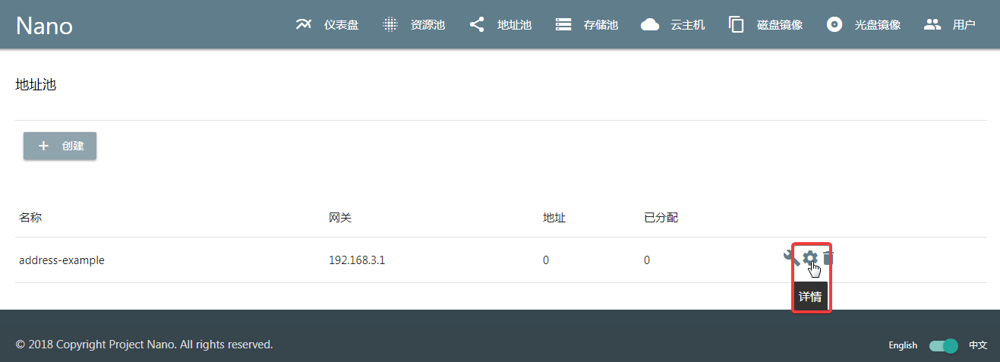

地址池详情界面，点击“添加”按钮，输入可用地址段的起止范围和子网掩码。创建新实例时，会从中选择IP地址并且通过DHCP服务绑定实例。为了避免与现有网络DHCP服务冲突，更有效地实现云主机IP资源的管理，使用中请注意以下几点：

1. **合理规划地址网段，确保现有DHCP网段和Nano地址池中地址网段不出现重叠，避免出现IP冲突**

2. **确保地址池备选网段与网关IP处于同一子网，网络可达，而且网关地址不应出现在备选网段中。如网关地址192.168.3.1，则备选网段应考虑192.168.3.2~192.168.3.240/24**

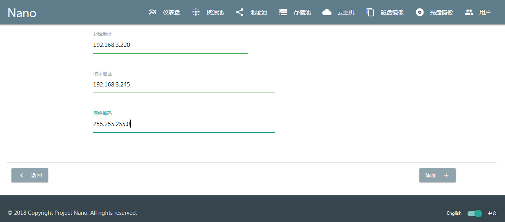

添加完成后可以在详情清单中看到可用地址段，如有需要，可以在一个地址池内添加多个分散的地址段，以便进行统一管理。

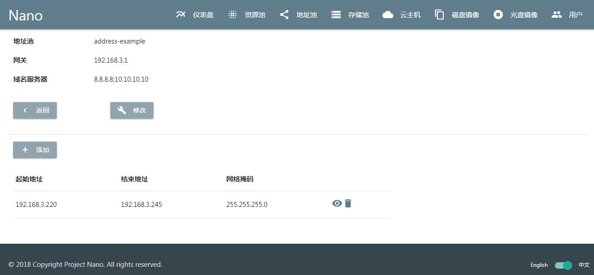

地址池创建完毕后，需要在计算资源池中指定使用地址池，才能正确分配地址。选择修改计算资源池或者新建资源池

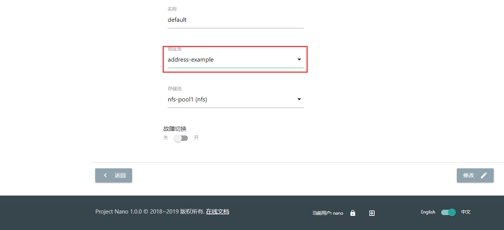

在下拉菜单中选择设置好的地址池即可，返回计算资源池列表查看地址池变更是否生效

.. image:: images/2_address_pool_modified.png

地址池变更后，该计算资源池新建实例时，就会自动分配IP地址并完成绑定。

为云主机实例分配的绑定地址可以在云主机详情或者地址池详情中查看

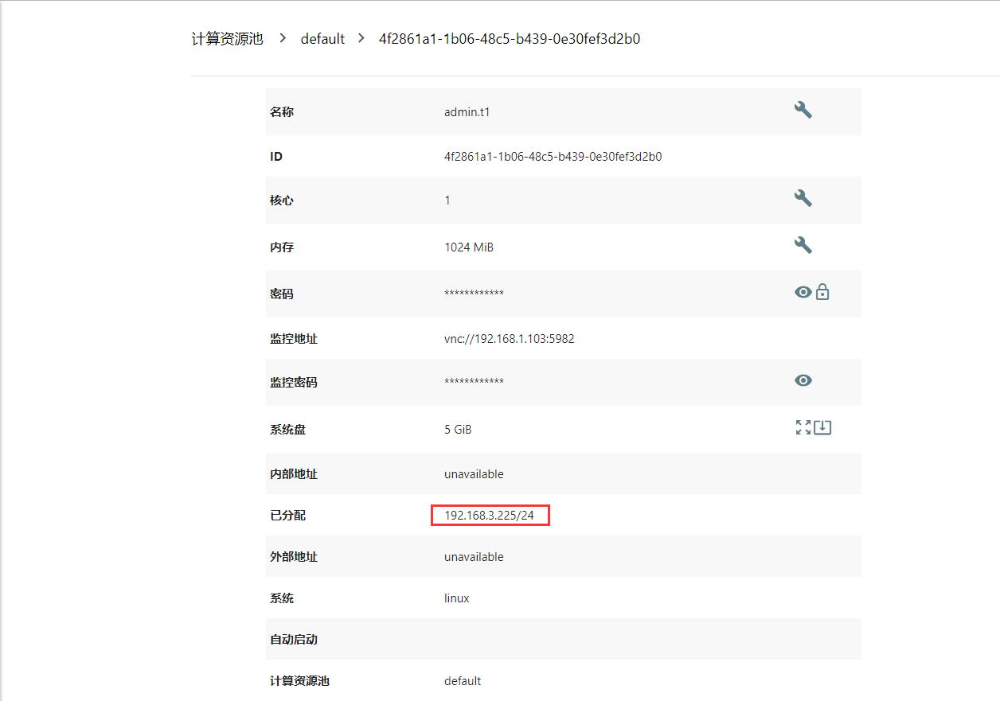

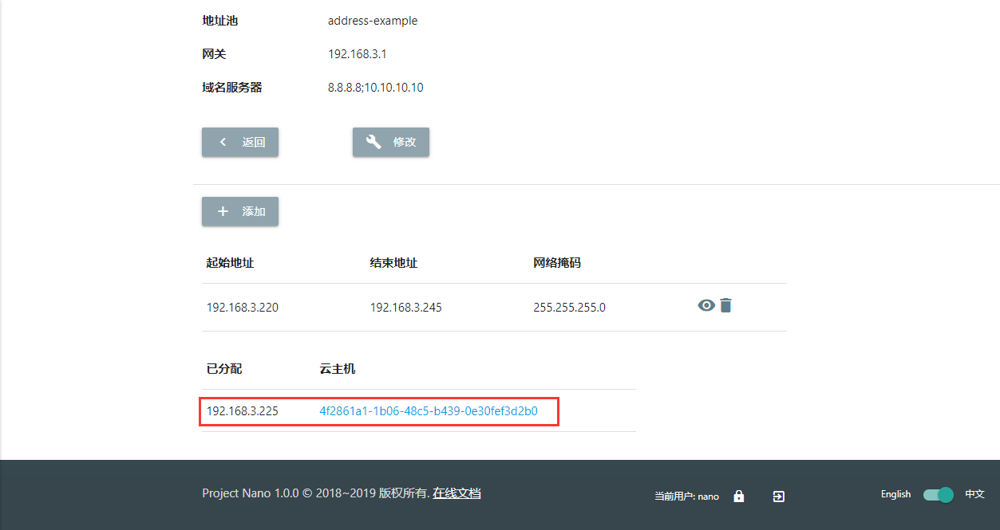

请注意，一个地址池可以关联多个计算资源池，地址池的服务器设置可以实时调整，关联关系也可以在线变更，但是在解除地址池绑定前，需要首先释放当前资源池中已经获得地址的实例。

添加资源
============

添加资源节点
................

Nano平台初次启动时，会默认创建一个名为Default的计算资源池，但是该资源池没有可用资源。你需要先将一个Cell节点添加到该资源池，以便有足够资源分配云主机。

在Web门户上，选择"Resource Pool"菜单，点击default资源池的"cells"按钮，进入资源节点清单：

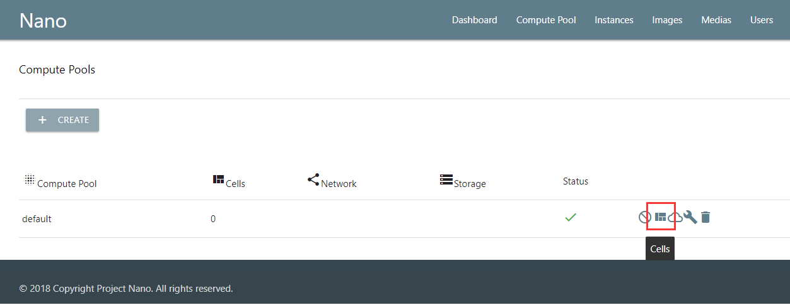

当前没有任何资源节点，点击"Add Cell"按钮，进入添加页面

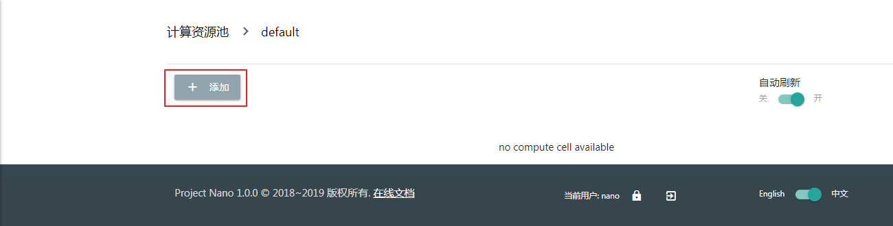

在下拉菜单中，选择目前平台中已经发现并且尚未加入资源池的Cell节点，完成添加

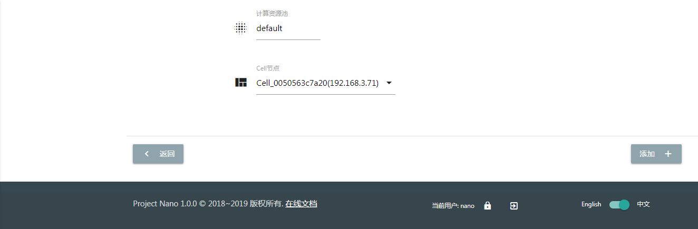

添加完成回到资源节点清单，可以看到新Cell已经加入资源池，并且处于可用状态。

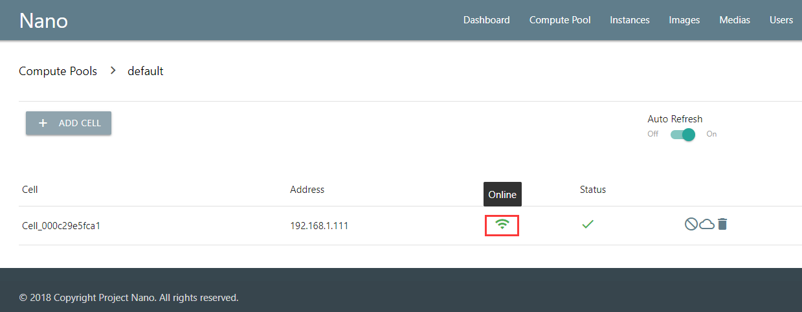

**请注意：如果资源池使用了共享存储，节点加入时可能会因为配置耗时太久产生超时提醒，这种情况不影响使用，重新刷新节点清单检查状态即可**

*对于使用共享存储的Cell节点，添加后请在节点清单中点击"Detail"图标，查看存储加载状态，确保后端存储已经成功挂载，如下图所示*

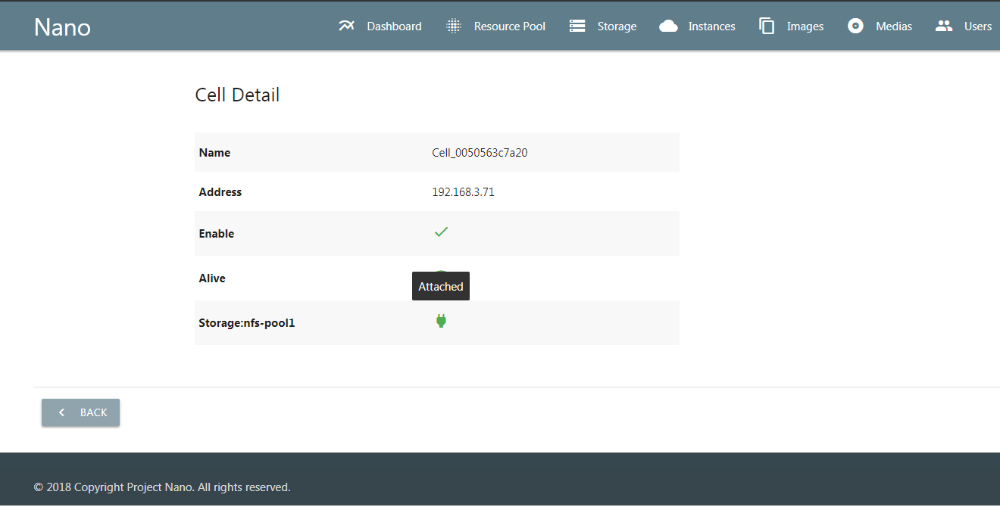

资源节点状态可用后，就可以在"Resource Pool"或者"Instances"菜单创建新主机实例了。

上传镜像
............

空白云主机并不能满足我们的日常使用要求，我们还需要安装操作系统和应用软件，Nano提供了多种手段能够快速部署可用云主机。

磁盘镜像
,,,,,,,,,,,,

磁盘镜像保存了模板云主机系统磁盘的数据，用户可以选择从预置的磁盘镜像克隆，新建云主机能够获得与模板云主机完全一致的系统和预装软件，有效减少系统重复安装部署的时间。

磁盘镜像中还可以通过预装Cloud-Init模块，配合Nano的CI服务，自动完成管理员密码初始化、系统磁盘扩容和自动数据盘格式化及挂载等配置任务。

Nano官网 `下载 <https://nanos.cloud/zh-cn/download.html>`_ 页面已经提供了CentOS 7.5 Minimal预置镜像（其中一个预装了Cloud Init）。

下载镜像，选择Web门户的"Images"=>"UPLOAD"上传到平台，后续创建云主机时就可以选择从镜像克隆了。

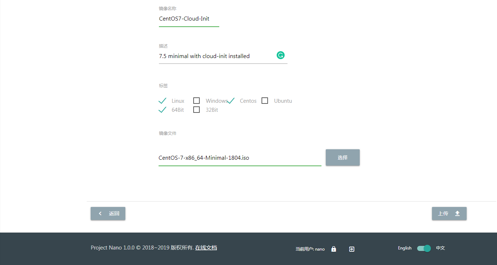

光盘镜像
,,,,,,,,,,,,

光盘镜像保存了ISO格式的光盘数据，可以加载到云主机中安装操作系统或者其他系统软件，通常用于定制模板云主机，详见云主机管理和平台管理章节。

----

系统部署完成后，就可以开始进行云主机和平台的管理了。
