.. instance .

.. contents:: 本章目录
  :depth: 2
  
-------------
云主机管理
-------------

 **请注意：目前推荐对于云主机使用直连模式的网络连接，即云主机通过物理服务器的桥接网络直接连入物理网络，默认使用DHCP从物理网络获取IP地址，与传统物理服务器的网络管理方式一致，尽量减少管理员维护网络的难度和工作量。**

创建云主机
=============

Nano中云主机是基于资源池创建的，Core收到创建云主机请求时，首先检测池内是否有可用Cell，然后评估各Cell可用资源和实时负载，选择加权负载最低的Cell创建实例。

在Nano中创建云主机时，有以下参数需要设置：

- 主机名：用于标识云主机，仅允许数字字母和'-'。
- 资源池：承载该实例的资源池名称，Nano会在指定资源池中选择合适的Cell节点进行创建
- 核心数：为云主机分配的核心数量，不建议设置超过Cell的最大物理线程数
- 内存：为云主机分配的内存大小，不能超过Cell的最大物理内存
- 系统版本：Nano会根据选择的版本对云主机硬件设置进行优化，在保证兼容性的情况提供更好的性能（如果操作系统版本较旧，建议选择Legacy System）
- 系统磁盘：选择云主机系统磁盘的数据源，详情见后
- 数据磁盘：选择是否为云主机挂载额外的数据盘
- 开机启动：启用后，当Cell服务器开机时，会自动启动云主机实例
- 系统镜像：是否从预制镜像生成云主机系统盘的数据
- CPU优先级：高优先级实例在繁忙时，会获得更多系统资源
- IOPS：设置磁盘IO读写上限，默认为无限制
- 上下行带宽：设置网络带宽限制，默认为无限制

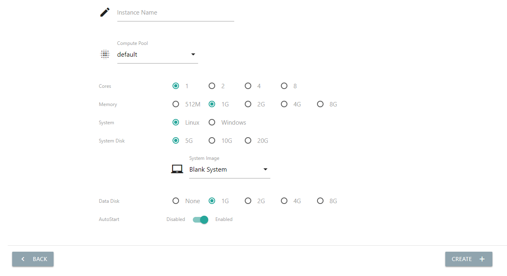

有三种系统盘数据源可选：空白系统、预制镜像和带Cloud-Init组件的预制镜像，Nano官网提供CentOS 7.5 Minimal的两种预制镜像 `下载 <https://nanos.cloud/zh-cn/download.html>`_

空白系统
-----------

空白系统是默认选项。顾名思义，空白系统意味着创建出的云主机没有安装任何操作系统和软件，需要通过加载光盘镜像安装操作系统。空白系统通常用于构建模板云主机，详情请看平台管理的《构建模板镜像》章节。

预制镜像
-----------

预制镜像的系统磁盘已经预装了操作系统和系统软件，并可能进行了一些配置优化和调整，预制镜像可以通过模板云主机构建，也可以从其他平台下载后直接上传系统。

创建云主机时，在系统镜像菜单中选择想要的预制镜像，克隆完成后的新主机拥有跟源镜像相同的系统和软件，能够开机直接使用。

.. image:: images/3_3_prebuilt_image.png

带Cloud-Init组件的预制镜像
-----------------------------

带Clout Init组件的预制镜像系统中，在普通预制镜像的基础上，额外安装了clout-init和cloud-utils组件（CentOS中可以使用yum指令安装），配合Nano提供的Cloud Init服务，可以实现初始化管理员账号、自动格式化并挂载数据盘和扩展系统盘容量等多种便利的管理功能，极大地方便管理员快速部署云主机实例。

带Clout Init组件的预制镜像同样可以通过模板云主机构建或者直接，使用时，除了选择源镜像，还需要勾选Cloud-Init模块并设置好初始化参数，以便Nano提供相应的服务。

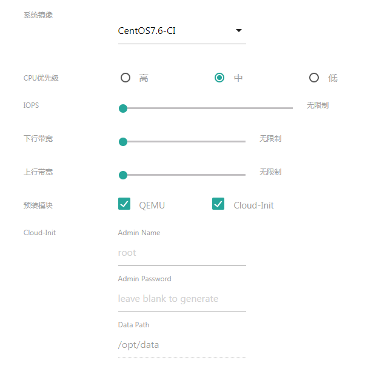

*请注意，只有镜像中预装了CI组件，并且创建时指定了CI服务的实例才会自动格式化并挂载数据盘同时扩容系统盘；否则需要手工在实例中进行处理。*

实例起停和监控
=================

用户可以通过主机监控、清单页面的控制栏按键管理实例的生命周期，新建云主机实例默认处于停止状态，可以使用以下功能启动云主机：

- 启动: 启动云主机，进入运行状态
- 从光盘启动: 从菜单中选择光盘镜像作为启动媒体，通常用于开机引导进入操作系统安装界面或者使用LiveCD恢复系统时使用
- 快照：管理该实例所创建的快照
- 创建磁盘镜像：基于当前云主机磁盘数据，构建新的磁盘镜像，用于批量复制
- 重置系统：将当前云主机系统数据还原到指定系统镜像
- 删除：永久删除该云主机实例
- 迁移：将云主机实例迁移到其他资源节点（仅支持基于共享存储创建的实例）
- 监控：监控云主机实例的实时资源用量
- 详情：可以对云主机实例进行更详细的配置和管理

云主机进入运行状态后，控制栏会展示以下按键

从左至右依次为：

- 远程控制：打开安全的VNC监控页面，直接控制云主机
- 停止: 模拟按下电源按键，正常关闭磁盘然后关机，数据不受影响（CentOS云主机中需要安装acpid服务）
- 强制终止: 强制关机，类似直接断电，可能会导致数据不一致甚至磁盘毁损
- 重启: 模拟按下重启按键，优雅重启，通常不影响数据（CentOS云主机中需要安装acpid服务）
- 强制重启: 强制重启，类似于reset按键，可能会导致数据不一致甚至磁盘毁损
- 插入/弹出媒体：将已上传的光盘镜像插入或者弹出主机实例
- 监控：监控云主机实例的实时资源用量
- 详情：可以对云主机实例进行更详细的配置和管理

在远程监控页面，用户可以像管理本地服务器一样直接在云主机上进行操作，该功能不依赖云主机内部系统，所以即使云主机没有网络或者系统无法启动，也能通过该页面进行排查和修复。

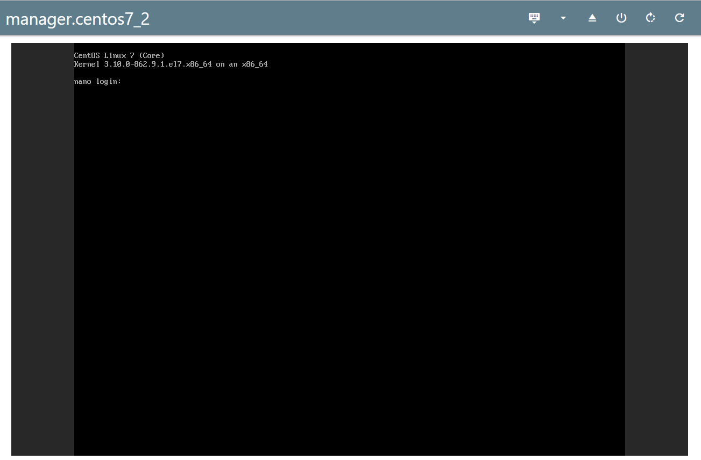

监控页面也提供了以下辅助功能，从左至右依次为：

.. image:: images/3_8_control_buttons.png

- 发送Ctrl+Alt+Del： 用于Windows等操作系统登录和重启
- 插入光盘镜像：将指定光盘镜像加载到云主机的光驱中，用于安装额外软件和系统
- 弹出光盘镜像：将光盘镜像弹出云主机光驱
- 关机：模拟按下电源按键，正常关闭磁盘然后关机，数据不受影响（CentOS云主机中需要安装acpid服务）
- 重启：模拟按下重启按键，优雅重启，通常不影响数据（CentOS云主机中需要安装acpid服务）
- 强制重启：类似于reset按键，可能会导致数据不一致甚至磁盘毁损

 **除了内置的HTML5监控页面，用户也可以通过主机详情页面查询VNC访问地址和密码，使用第三方vnc软件连接和管理云主机。**

主机详情及配置修改
====================

在云主机实例清单的控制栏中，用户可以点击

进入实例运行仪表盘，了解实时的资源用量和相关状态信息：

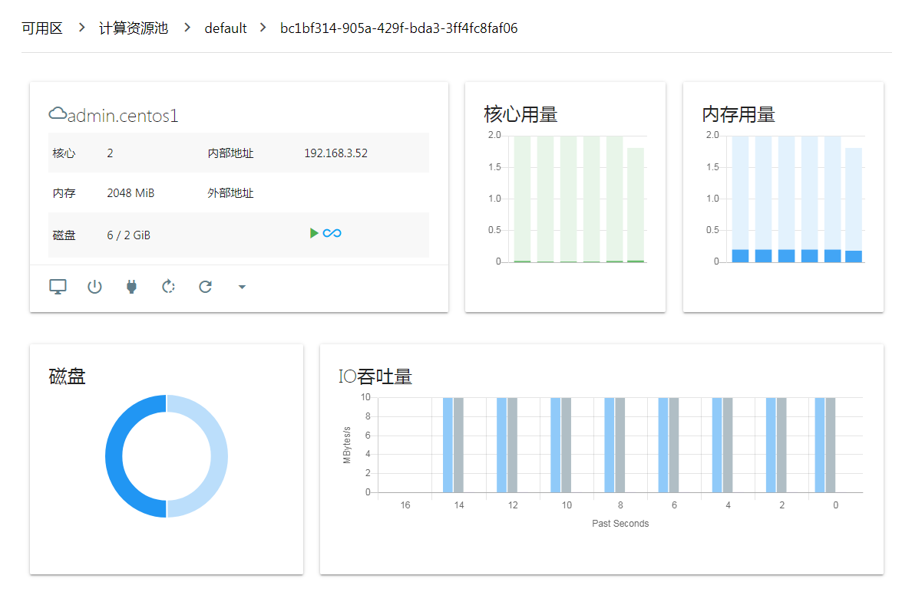

当默认创建时的资源选项不满足需要，或者需要重新调整实例资源配置的时候，可以点击

进入实例详情页面：

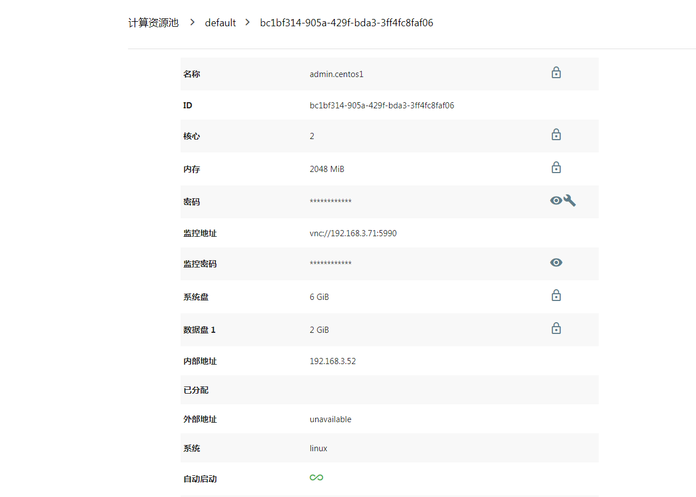

详情页面提供了以下功能：

- 修改实例名称
- 修改核心数、内存等资源配置用量
- 扩展或者压缩磁盘容量（压缩磁盘容量仅减少镜像文件物理空间占用，不减少逻辑容量，根据磁盘大小，该功能可能用时较长，如果出现超时告警，不影响功能使用）
- 修改管理员密码（需要云主机安装qemu-guest-agent）
- 查看VNC监控地址和连接密码
- 修改CPU优先级、磁盘IO和网络带宽限制

目前修改管理员密码功能只能在线调整，其他功能需要先将云主机停机后再操作。

快照及恢复
=============

快照可以保存云主机的历史状态，并且在需要时恢复回去，可以有效避免误操作或者数据毁损。

当云主机处于停机状态时，点击图标

进入快照管理界面

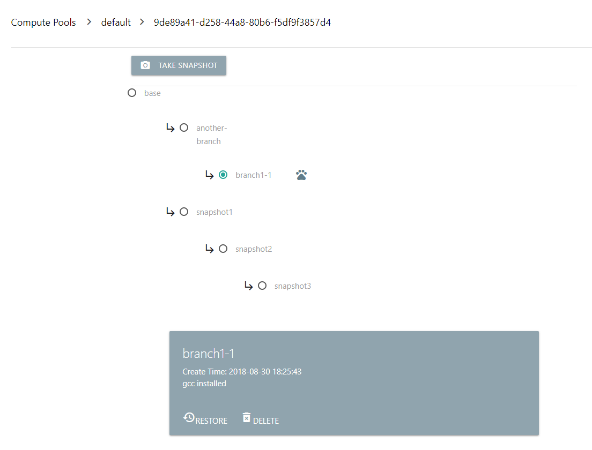

你可以输入快照名称和描述，将当前云主机数据保存到新的快照中

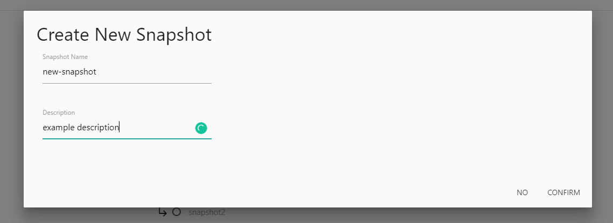

也可以选择把系统状态恢复到特定快照或者删除某个快照

图标

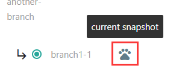

标识当前活动的快照，活动快照或者还被依赖的快照无法删除

光盘镜像加载
=============

管理员可以将光盘镜像加载到运行中的实例中，以便安装软件或者操作系统。

在运行状态的云主机实例操作栏中，点击插入镜像

在弹出菜单中选择需要插入的光盘镜像即可，插入实时生效，跟使用笔记本一样方便快捷。

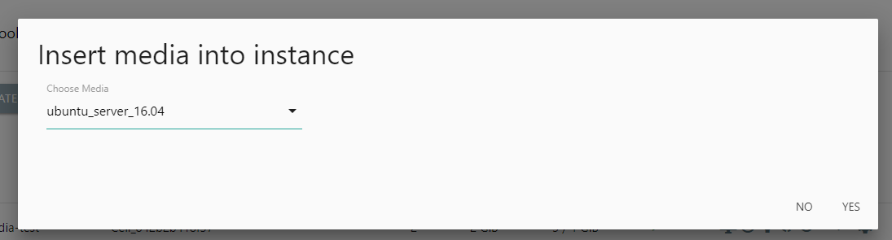

插入成功后，云主机实例的状态栏会显示已插入媒体的状态图标：

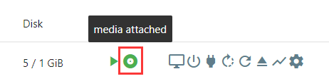

此时，点击弹出镜像功能即可将光盘镜像从实例中卸载

重置系统
==========

当需要恢复云主机操作系统或者安装新系统时，可以选择直接从系统已有镜像重置云主机系统。

首先停止云主机，在功能按钮中选择“重置系统”

重置界面里选择需要安装的镜像，点击开始重置。

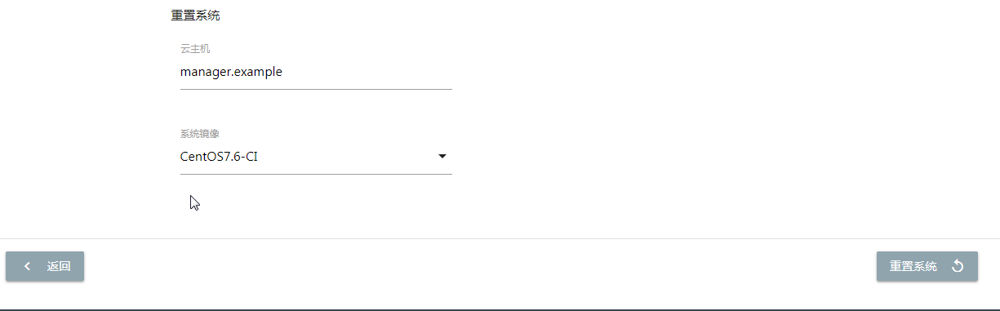

成功完成后，云主机的系统磁盘就会恢复到新装状态。

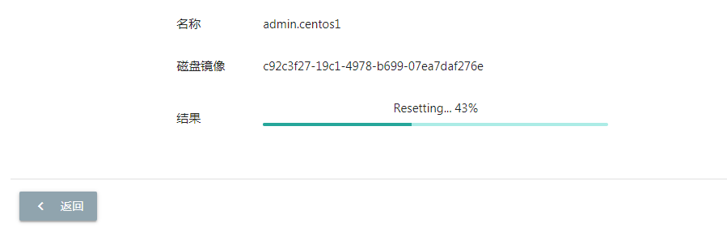

实例迁移
==========

为了方便管理员手工优化资源配置和进行日常停机维护，Nano提供了云主机实例迁移功能。 **请注意，实例迁移必须基于后端共享存储使用。**

单实例迁移
------------

单实例迁移可以将一个实例迁移到指定Cell节点，用于优化资源配置或者服务性能。在云主机清单中选择已停机的实例，点击“Migrate/迁移”功能

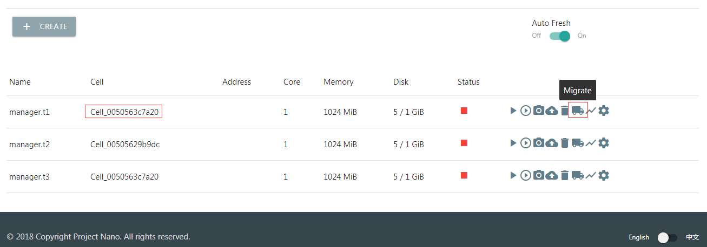

在弹出菜单中选择迁移目标节点，确认后等待迁移完成即可。

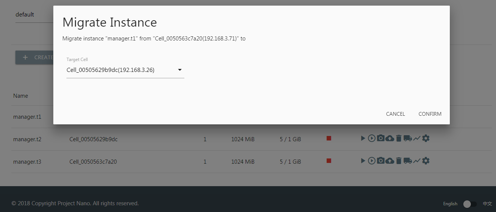

迁移完成后可以看到云主机承载节点已变更（如果使用第三方远程管理工具，请注意此时监控地址也已经迁移到新Cell节点，请查看云主机详情获取新地址）

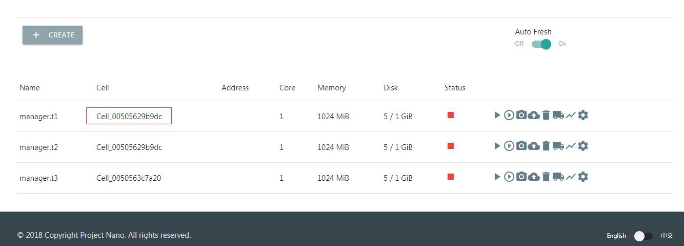

全节点迁移
------------

全节点迁移是将一个Cell节点的所有实例迁移到其他节点上，通常用于停机维护或者服务器搬迁。

在Cell节点列表中，点击“Migrate/迁移”功能

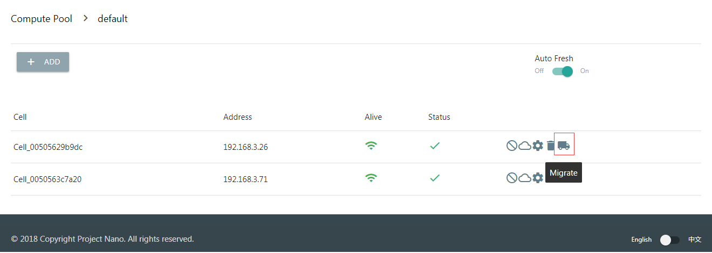

在弹出菜单中选择迁移目标节点，确认后等待迁移完成即可。

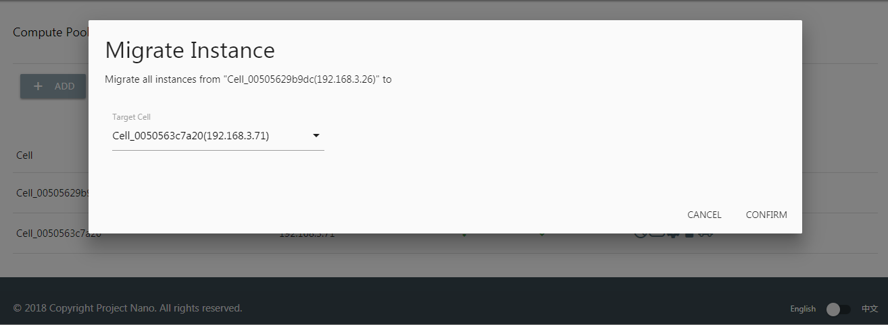

批量处理
==========

当需要管理大量实例时，批量处理能够有效提升管理效率。

批量创建
------------

批量创建功能能够一次性创建一批配置相同的云主机，批量创建与原有创建功能一样，同样能够选择从源镜像克隆或者使用CloudInit进行实例初始化。在云主机列表中，点击"批量创建"按钮启用。

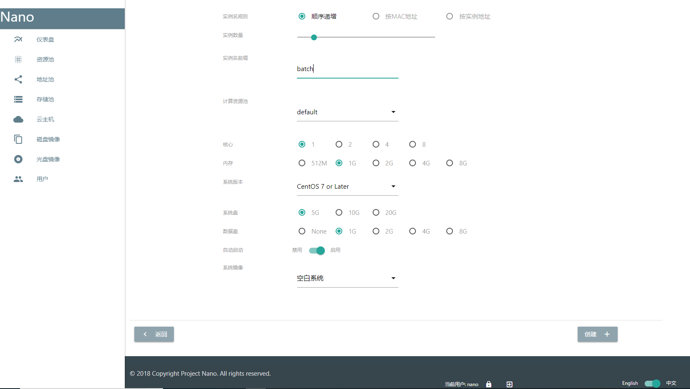

批量删除
------------

云主机列表界面，点击进入批量模式，就可以同时选中多个实例，一次性删除。

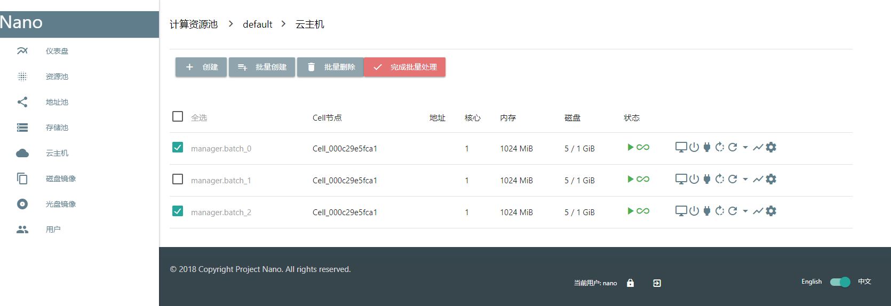

批量停止
------------

云主机列表界面，点击进入批量模式，就可以同时选中多个实例，一起停止。
