.. platform .

.. contents:: 本章目录
  :depth: 2
  
---------
平台管理
---------

Nano提供了一系列便捷的管理功能，用于简化管理员的日常运维工作。

仪表盘
===========

Nano门户首页提供了整个平台级别的资源用量仪表盘，包含虚拟资源和物理资源的用量，便于随时了解系统负载情况，及时对资源进行扩充或者调整。

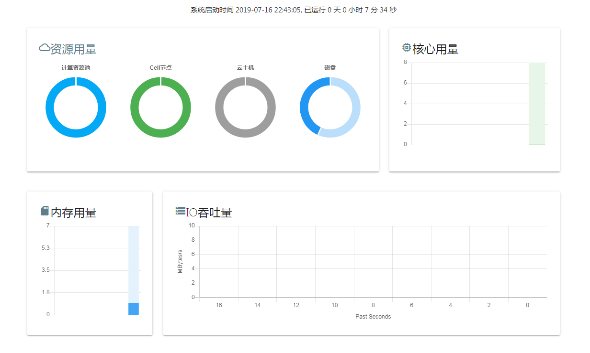

管理员可以点击仪表盘，下钻查看资源池、Cell节点或者云主机实例的实时用量

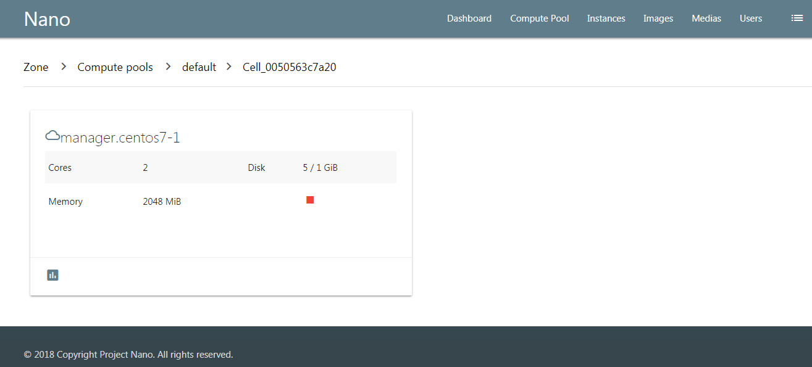

增加资源节点
=============

当系统负载较大时，可以通过添加新的资源节点，来扩充池内可用资源。

首先需要在新的服务器上部署并启动Cell模块，然后在资源池的节点清单中，选择"Add Cell"

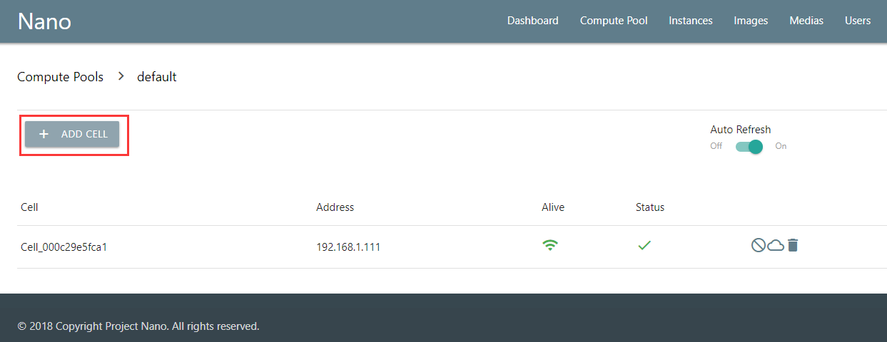

在下来菜单中选择新装的Cell节点进行添加

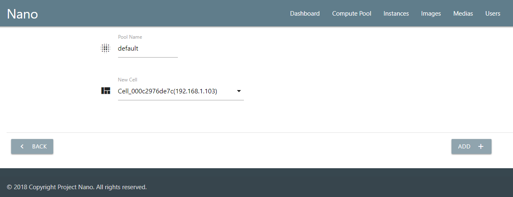

当资源池中Cell节点状态变为Online时，就可以承载新建的云主机实例了。

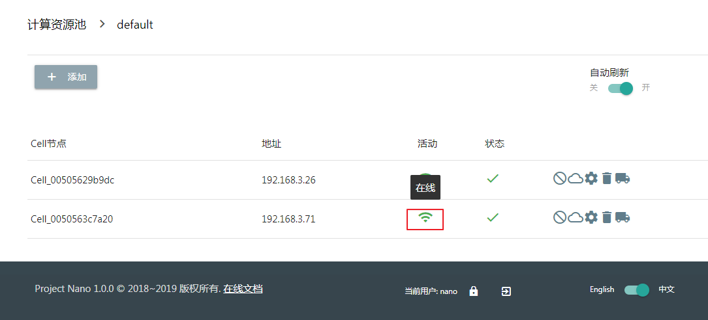

构建模板镜像
=============

Nano可以将任意云主机的系统磁盘制作成磁盘镜像，然后从镜像快速克隆出与原模板主机系统、软件一样的新实例，以便大幅度提升管理员部署实例的效率。

.. image:: images/4_image_transport.png

要构建模板镜像，首先应该创建一个不含数据磁盘的空白云主机，然后通过加载系统光盘和网络方式安装好系统和软件。

以CentOS7为例，构建模板主机时，建议进行如下设置：

- 设置模板主机名和默认用户密码
- 默认启用网络并设置为DHCP获取地址
- 安装acpid服务支持关机和重启操作
- 安装qemu-guest-agent以支持实时密码修改、内存用量监控等功能
- 使用yum更新软件版本
- 如果需要使用Nano的Cloud Init服务对实例进行自动初始化设置，则需要安装cloud-init/cloud-utils组件

上述设置完成后，关闭云主机，通过"Images" => "BUILD"，进入镜像构建界面，在下拉菜单中选择模板云主机，点击创建

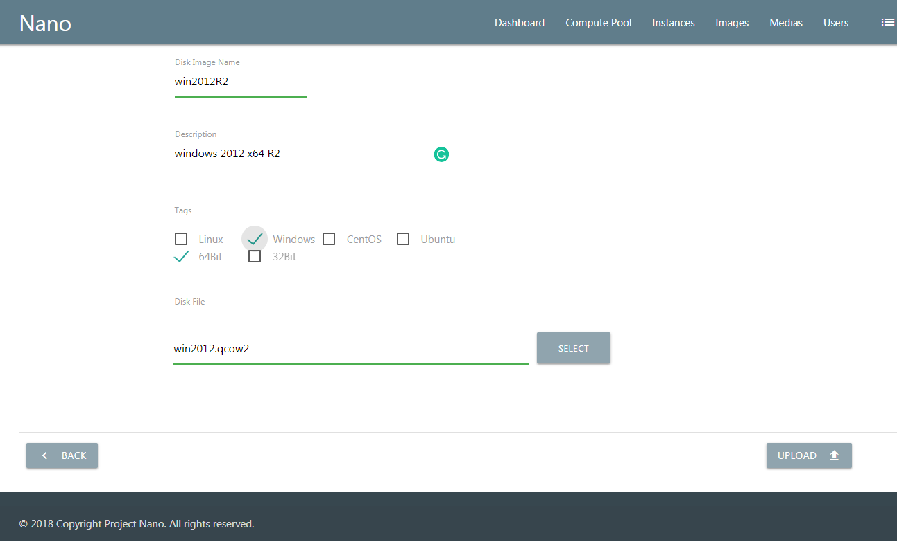

当镜像制作完毕后，你就可以在新建云主机时选择从该镜像克隆实例了。

用户管理
===========

Nano提供用户、组、角色三个层级的权限管理，来满足团队对于安全内控的要求。

Nano目前权限控制按照功能菜单来划分，一个角色可以选择可以使用的功能菜单列表；一个用户组可以拥有多个角色；用户登录后，根据所属用户组的角色来获得自己可用的功能。一个用户只能属于一个用户组。

角色权限
------------

管理员可以创建多个角色，可以为每个角色设置其可以使用的功能菜单，对应用户登录后，系统会根据角色权限生成管理界面。

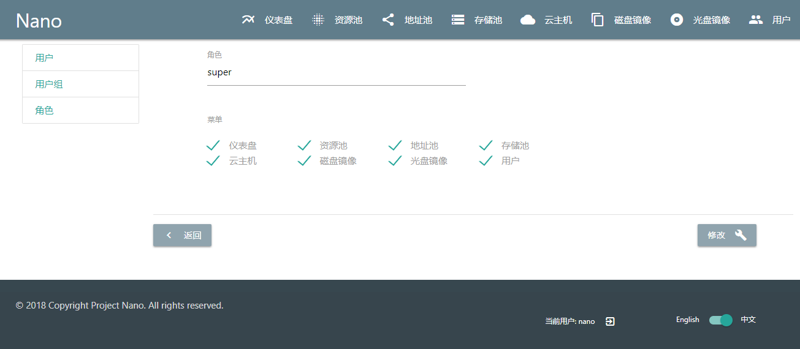

用户
--------

用户账户是登录管理平台必要的身份凭据，后续也会涉及到资源所属的管理。增加用户时，只需要在用户清单点击新建，然后输入用户信息即可。

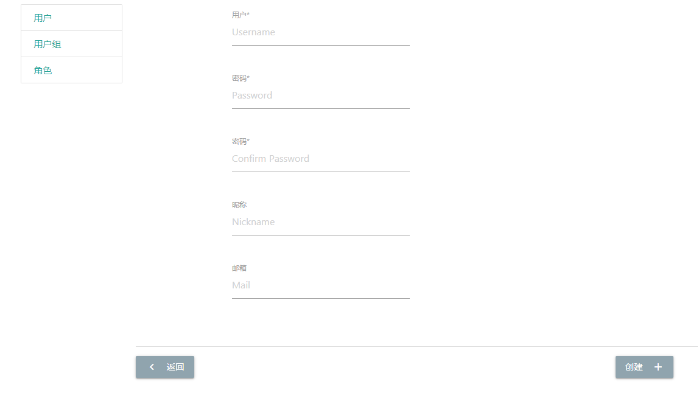

**请注意，新建用户虽然可以登录，但是必须加入用户组才能获得相应的菜单权限。**

用户组
----------

用户组是权限管理的核心，一个用户组能够拥有多个角色，能使用的功能菜单为所有角色所属菜单的集合。

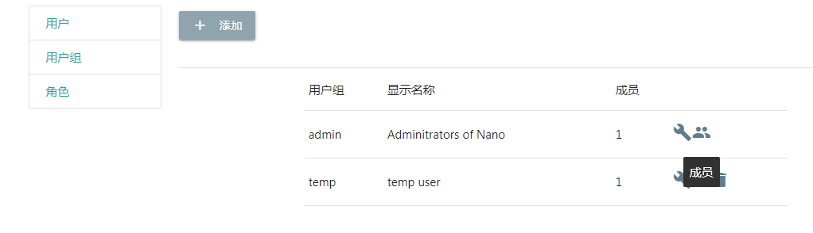

在用户组清单中，进入目标组的成员清单，点击添加，选择要加入该组的已创建用户。

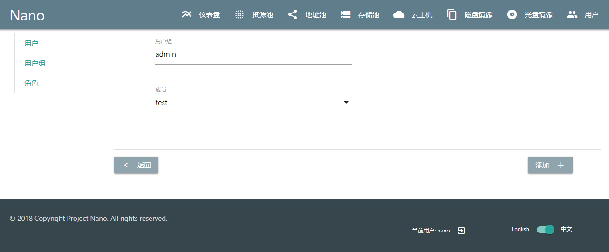

添加成功后，该用户登录时就可以访问相应的功能菜单了

资源可见性
------------

云主机实例、磁盘镜像和光盘镜像都是系统资源，默认情况下，系统资源仅能由创建者访问。管理员可以通过可见性设置，允许访问同一组内其他用户创建的资源，以便实现组内资源共享。

密码修改
------------

已登录用户可以点击底部的按钮，修改自己的登陆密码

系统操作日志
===========

Nano记录包括登录失败在内的用户操作日志，用于审计用户操作，排查系统故障。当日志过多时，也可以通过日志管理界面进行清除。在需要的用户角色里，添加“log”菜单即可。

版本升级
===========

Nano所有模块使用go编译为二进制可执行文件，无需外部库依赖，配置和数据文件格式通常保持后向兼容，无需用户干预。

Nano能够通过两种方式进行升级，启动Installer并且选择"4"可以进行自动升级，自动升级会根据用户输入的安装路径，检查已经安装模块进行替换，并且自动停止并重启运行中的模块，是推荐的升级方式。

当自动升级方式出现问题时，可以选择手动升级，只需要使用"./模块名 stop"停止运行中的模块文件，替换可执行文件后使用"./模块名 start"重新启动服务即可。

唯一例外是FrontEnd模块还包含前端页面文件，所以升级时，除了要替换可执行文件，还需要手工将页面和js脚本文件从发布包中复制resource目录下进行覆盖。

以升级到1.0.0为例，假定旧版本已经安装在/opt/nano目录下

::

  下载并解压新版本
  $cd ~
  $wget https://nanos.cloud/media/nano_installer_1.0.0.tar.gz
  $tar zxfv nano_installer_1.0.0.tar.gz

  替换Cell模块
  $cd /opt/nano/cell
  $./cell stop
  $cp ~/nano_installer/bin/cell .
  $./cell start

  替换Core模块
  $cd /opt/nano/core
  $./core stop
  $cp ~/nano_installer/bin/core .
  $./core start

  替换FrontEnd模块
  $cd /opt/nano/frontend
  $./frontend stop
  $cp ~/nano_installer/bin/frontend .
  $\cp ~/nano_installer/bin/frontend_files/resource/. resource/ -Rf
  $./frontend start

网络变更
===========

Core与FrontEnd使用指定地址为用户提供服务，所以当所在服务器IP发生变化时，需要修改config目录下的配置IP，然后重启模块完成变更。

Cell模块通过组播协议和Core模块自动发现所在服务器地址并完成组网，所以当Cell服务器IP变化时，只需要重新启动Cell模块，后续地址变更、组网和实例网络调整由可以由系统自动完成，无需网络干预。

当整个平台整体迁移或者变更到完全不同的网络时，请首先调整Core模块的监听IP和组播信息，确保Core模块正常启动后，再启动Cell模块，完成新网络识别和自动切换即可。

故障迁移
==========

当计算资源池使用共享存储作为后端存储时，可以开启故障迁移(Failover)开关。功能开启后，如果Nano平台检测到某一Cell节点失联，会自动将该节点管理的云主机实例迁移到集群内的一个或者多个Cell节点上。

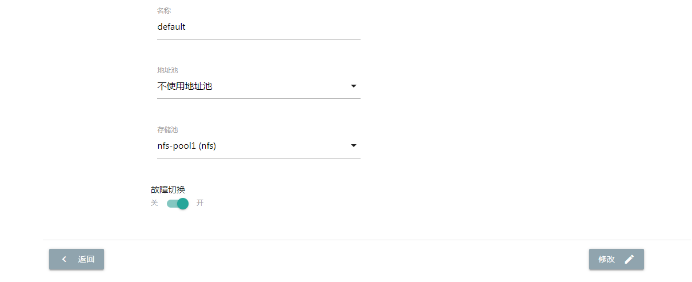

如果原实例设置了自动启动，则迁移完成后，系统会自动将实例启动进入服务状态。

**如果失联Cell节点恢复并重新加入Nano集群，系统将自动清除该Cell上的所有实例，并将该Cell置于禁用状态，管理员需要手动重新启用节点。**

禁用节点
==========

默认情况下，Nano会在资源池中选择负载较低的活动Cell节点创建云主机实例，但是用户可以选择手动禁用Cell节点，来避免在该节点上分配新的云主机实例，便于进行维护或者控制节点负载。

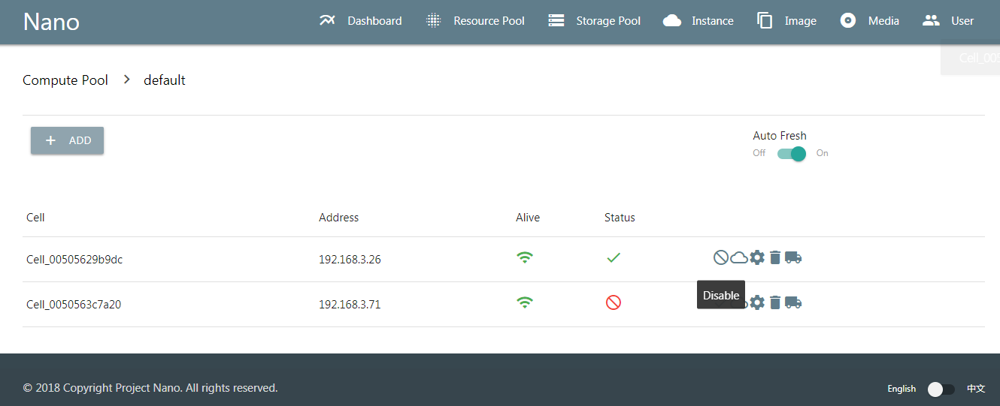

禁用的节点上云主机依然正常运行和管理，不受影响。禁用节点可以稍后手动重新启用，恢复承接新实例。

多语言
========

Nano管理页面目前支持中文、英文两种语言，可以在界面开关切换，Nano会记住用户选项，只需选择一次，不用反复设置。
